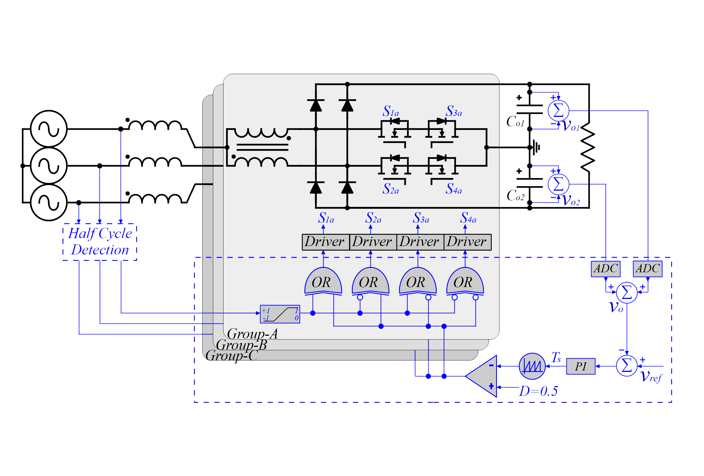

# IVR-PFM Simulation Dataset

## Authors

**Jefferson Wilhelm Meyer Soares**  
Federal University of Technology – Paraná (UTFPR), Curitiba, Brazil  
Instituto Federal do Paraná (IFPR), Jacarezinho, Brazil  
ORCID: [https://orcid.org/0000-0003-3372-9298](https://orcid.org/0000-0003-3372-9298)

**Édwin Augusto Tonolo**  
Federal University of Technology – Paraná (UTFPR), Curitiba, Brazil  
ORCID: [https://orcid.org/0000-0002-8644-650X](https://orcid.org/0000-0003-3372-9298)

**Alceu André Badin**  
Federal University of Technology – Paraná (UTFPR), Curitiba, Brazil  
ORCID: [https://orcid.org/0000-0003-3243-4092](https://orcid.org/0000-0003-3372-9298)

---

## Abstract

This dataset provides a simulation file for the Interleaved Vienna Rectifier with Pulse-Frequency Modulation (IVR-PFM) topology, developed for three-phase, three-wire applications. The simulation is designed for use with PSIM software and is configured to operate with a 220 V, 60 Hz line input voltage, delivering 3 kW of output power at 800 V. The IVR-PFM behaves as a resistive load at the input, with the equivalent resistance defined as Re = 4Lmfs, where Lm is the magnetizing inductance and fs is the switching frequency. The file includes a closed-loop implementation, which can be modified for open-loop tests by disabling the control loop and enabling the open-loop configuration.



---

## Instructions

### 1. Simulation Overview

* **Input Voltage:** 220 V, 60 Hz (three-phase, three-wire system)
* **Output Power:** 3 kW
* **Output Voltage:** 800 V
* **Control Strategy:** Closed-loop implementation, adjustable for open-loop operation
* **Topology Behavior:** The converter behaves as a resistive load at the input, with an equivalent resistance Re = 4Lmfs (Lm: magnetizing inductance; fs: switching frequency)

### 2. File Contents

The dataset includes the following files:

* `IVR-PFM_Simulation.psimsch`: The primary simulation file for PSIM software
* `components_data.txt`: Component specifications and parameters

### 3. Instructions for Use

#### 3.1 Closed-Loop Operation

The simulation is pre-configured for closed-loop control. In this mode, the converter operates under nominal conditions, maintaining the desired output power and voltage.

#### 3.2 Open-Loop Operation

To perform open-loop tests:

1. Disable the closed-loop circuitry in the simulation file
2. Enable the open-loop configuration circuitry
3. Adjust the switching frequency to vary the input power level (lower switching frequency increases power conversion)

To facilitate the balance between input and output power in open-loop mode, enable the voltage source labeled "Vo" in the output stage and adjust its value if desirable.

### 4. Key Features of the IVR-PFM Topology

* Soft-switching operation with reduced stress on semiconductors
* Continuous input current with resistive behavior
* Simplified control strategy without the need for current sensing

### 5. Additional Notes

The simulation is configured for nominal conditions, but users can modify parameters such as load, switching frequency, and control strategy to explore different operating scenarios.

---

## Requirements

* PSIM software (version 2024 or compatible)

---

## Citation

If you use this simulation in your research, please cite:
```bibtex
@software{soares2025ivrpfm,
  author = {Soares, Jefferson Wilhelm Meyer and Tonolo, Édwin Augusto and Badin, Alceu André},
  title = {IVR-PFM Simulation Dataset},
  year = {2025},
  publisher = {GitHub},
  url = {https://github.com/WilhelmMeyer/IVR-PFM-Simulation}
}
```

---

## Related Publications

### Main Publication

J. W. M. Soares, É. A. Tonolo and A. A. Badin, "Interleaved Vienna Rectifier With Pulse Frequency Modulation for Three-Phase Three-Wire Applications," in IEEE Transactions on Industrial Electronics, 2025. DOI: [10.1109/TIE.2025.3607969](https://doi.org/10.1109/TIE.2025.3607969)

### Additional Related Publications

É. A. Tonolo, J. W. M. Soares and A. A. Badin, "Multiphase Interleaved Boost Converter With Frequency Modulation for Sensorless Current Sharing," in *IEEE Transactions on Industrial Electronics*, vol. 71, no. 12, pp. 16360-16369, 2024. DOI: [10.1109/TIE.2024.3497341](https://doi.org/10.1109/TIE.2024.3497341)

É. A. Tonolo, J. W. M. Soares and A. A. Badin, "Frequency-Modulated High-Gain Boost-Flyback DC-DC Converter for Renewable Energy Systems," in *IEEE Transactions on Industrial Electronics*, vol. 71, no. 8, pp. 8974-8983, 2024. DOI: [10.1109/TIE.2023.3335456](https://doi.org/10.1109/TIE.2023.3335456)

J. W. M. Soares, É. A. Tonolo and A. A. Badin, "Current Sensorless Boost-Type Power Factor Correction by Integrating SC-PFM and Vienna Rectifier with Input Continuous Conduction," in *2023 IEEE 8th Southern Power Electronics Conference (SPEC)*, Florianopolis, Brazil, 2023, pp. 1-6. DOI: [10.1109/SPEC56436.2023.10408520](https://doi.org/10.1109/SPEC56436.2023.10408520)

É. A. Tonolo, J. W. M. Soares and A. A. Badin, "An Interleaved Current-Fed PFC Isolated Converter with Voltage Follower Characteristics," in *2023 IEEE 8th Southern Power Electronics Conference (SPEC)*, Florianopolis, Brazil, 2023, pp. 1-6. DOI: [10.1109/SPEC56436.2023.10408575](https://doi.org/10.1109/SPEC56436.2023.10408575)

J. W. M. Soares, É. A. Tonolo and A. A. Badin, "High-Efficiency Interleaved Totem-Pole PFC Converter With Voltage Follower Characteristics," in *IEEE Journal of Emerging and Selected Topics in Power Electronics*, vol. 11, no. 1, pp. 633-642, 2023. DOI: [10.1109/JESTPE.2022.3231131](https://doi.org/10.1109/JESTPE.2022.3231131)

É. A. Tonolo, J. W. M. Soares and A. A. Badin, "Current Sensorless MPPT With a CCM Interleaved Boost Converter for Renewable Energy System," in *IEEE Transactions on Power Electronics*, vol. 37, no. 9, pp. 10474-10486, 2022. DOI: [10.1109/TPEL.2022.3166747](https://doi.org/10.1109/TPEL.2022.3166747)

J. W. M. Soares, É. A. Tonolo and A. A. Badin, "An Interleaved PFC Boost Converter With Soft Commutations and Voltage Follower Characteristics," in *IEEE Transactions on Industrial Electronics*, vol. 69, no. 7, pp. 6705-6714, 2021. DOI: [10.1109/TIE.2021.3101020](https://doi.org/10.1109/TIE.2021.3101020)

J. W. M. Soares, É. A. Tonolo and A. A. Badin, "Switching Cell With Frequency Modulation for CCM Voltage-Follower Converters," in *IEEE Transactions on Power Electronics*, vol. 36, no. 7, pp. 7580-7591, 2021. DOI: [10.1109/TPEL.2020.3041454](https://doi.org/10.1109/TPEL.2020.3041454)

---

## License

This project is licensed under the MIT License - see the [LICENSE](LICENSE) file for details.

---

## Repository Structure
```
IVR-PFM-Simulation/
├── README.md
├── LICENSE
├── CITATION.cff
├── simulation/
│   ├── IVR-PFM_Simulation.psimsch
│   └── components_data.txt
├── images/
│   └── control-scheme.png
└── docs/
```

---

## Contact

For questions or collaboration opportunities, please open an issue in this repository.